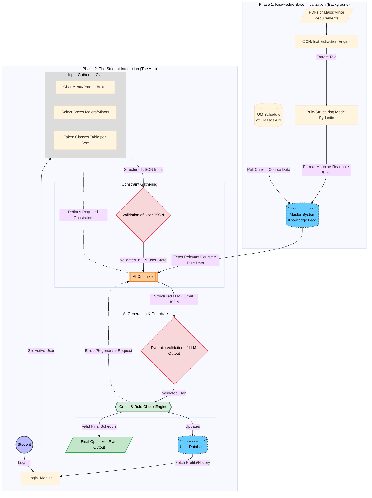

# Project Title: U of M AI Scheduler

Detailed project description goes here.

```mermaid
%%{init: {'theme': 'base', 'graph': {'curve': 'basis'}}}%%
graph TD
    subgraph Phase1_KnowledgeIngestion["Phase 1: Knowledge-Base Initialization (Background)"]
        direction TB
        UM_API[(UM Schedule<br/>of Classes API)]
        Major_Minors_PDFs[/PDFs of Major/Minor<br/>Requirements/]
        OCR[OCR/Text Extraction Engine]
        Struct_Rules[Rule-Structuring Model Pydantic]

        UM_API -->|Pull Current Course Data| MasterDB
        Major_Minors_PDFs --> OCR
        OCR -->|Extract Text| Struct_Rules
        Struct_Rules -->|Format Machine-Readable Rules| MasterDB
        MasterDB[(Master System<br/>Knowledge Base)]
    end

    subgraph Phase2_StudentJourney["Phase 2: The Student Interaction (The App)"]
        direction TB
        Student_Actor((Student)) -->|Logs In| Login_Module
        UserDB[(User Database)] -->|Fetch Profile/History| Login_Module
        Login_Module -->|Set Active User| Input_GUI

        subgraph Input_GUI[Input Gathering GUI]
            direction LR
            Chat_UI[Chat Menu/Prompt Boxes]
            Select_Boxes[Select Boxes Majors/Minors]
            History_Boxes[Taken Classes Table per Sem]
        end

        Input_GUI -->|Structured JSON Input| Pydantic_User_Input

        subgraph Constraint_Processing[Constraint Gathering]
            direction TB
            Pydantic_User_Input{Validation of User JSON}
            Pydantic_User_Input -->|Validated JSON User State| LLM_Scheduler
            MasterDB -->|Fetch Relevant Course & Rule Data| LLM_Scheduler
        end

        subgraph AI_Core[AI Generation & Guardrails]
            direction TB
            LLM_Scheduler[[AI Optimizer]]
            LLM_Scheduler -->|Structured LLM Output JSON| Pydantic_LLM_Output
            Pydantic_LLM_Output{Pydantic Validation of LLM Output}
            Pydantic_LLM_Output -->|Validated Plan| Credit_Engine
            Credit_Engine{{Credit & Rule Check Engine}}
        end
        
        Input_GUI -.-|Defines Required Constraints| LLM_Scheduler
        Credit_Engine -->|Updates| UserDB
        Credit_Engine -->|Valid Final Schedule| Final_Output[/Final Optimized Plan Output/]
        Credit_Engine -.->|Errors/Regenerate Request| LLM_Scheduler
    end

    %% Legend/Styling
    classDef Actor fill:#bbf,stroke:#333,stroke-width:2px,color:black;
    classDef Database fill:#66ccff,stroke:#333,stroke-width:2px,color:black,stroke-dasharray: 5 5;
    classDef Optimizer fill:#ffcc99,stroke:#e67e22,stroke-width:2px,color:black;
    classDef GUI fill:#dcdcdc,stroke:#333,stroke-width:1px,color:black;
    classDef Output fill:#c3e6cb,stroke:#28a745,stroke-width:2px,color:black;
    classDef Validator fill:#f8d7da,stroke:#dc3545,stroke-width:2px,color:black;
    classDef LogicEngine fill:#d4edda,stroke:#155724,stroke-width:2px,color:black;

    class Student_Actor Actor;
    class MasterDB,UserDB Database;
    class LLM_Scheduler Optimizer;
    class Input_GUI GUI;
    class Final_Output Output;
    class Pydantic_User_Input,Pydantic_LLM_Output Validator;
    class Credit_Engine LogicEngine;
```
